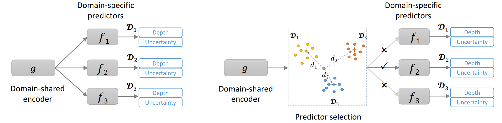
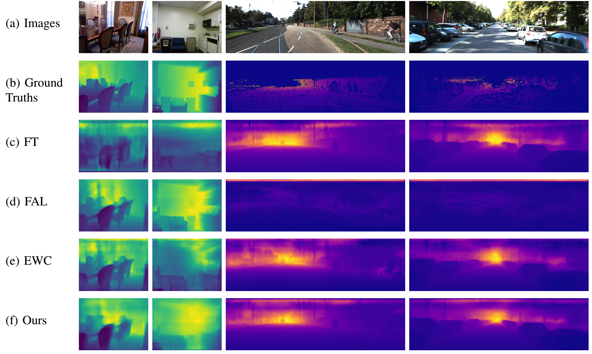

# Lifelong-MonoDepth: Lifelong Learning for Multi-Domain Monocular Metric Depth Estimation

We present an efficient multi-head framework that enables lifelong, cross-domain, and scare-aware monocular depth learning. Depth maps in the real world are significantly different across domains; their quality and scales are domain dependent. Therefore, the model has to assemble multiple prediction branches for multi-domain metric depth inference. To this end, we present a framework that consists of a domain-shared encoder and multiple domain-specific predictors. The framework allows robust metric depth learning across multi-domains. For more detailed information, please check our [paper](https://arxiv.org/pdf/2303.05050.pdf).

 

Results
-
We show through experiments that the proposed method can 

+ enable lifelong learning for scare-aware depth estimation,
+ cope with significant domain shift, 
+ infer a depth map in real time.

Qualitative comparisons:

 

Datasets
-
We provided data index of RGB and depth pairs for both training and test set of all three datasets in csv file, you can find them in ./datasets/. Then, download the data required for training and test.

+ NYU-v2 (0~10 meters), download via the [link](https://drive.google.com/file/d/1WoOZOBpOWfmwe7bknWS5PMUCLBPFKTOw/view?usp=sharing)  
+ KITTI (0~80 meters), download via the [official homepage](https://www.cvlibs.net/datasets/kitti/eval_depth.php?benchmark=depth_prediction) 
+ ScanNet (0-6 meters), download via the [official homepage](http://www.scan-net.org/#code-and-data) 

Trained Models
-
We provide all trained models as follows. We name the model in the order of learning.

| Models | Description |
| --- | --- |
| [N.pth.tar](https://drive.google.com/file/d/1EF9rLkgvM5igo-yT6yVSj4hU_FoqjEiQ/view?usp=sharing) | Trained model on the NYU-v2 |
| [K.pth.tar](https://drive.google.com/file/d/1EF9rLkgvM5igo-yT6yVSj4hU_FoqjEiQ/view?usp=sharing) | Trained model on the KITTI |
| [S.pth.tar](https://drive.google.com/file/d/1IVmJ7-B5VV65PsjIgk4knQ4hhvbYOVqb/view?usp=sharing) | Trained model on the ScanNet |
| [NK.pth.tar](https://drive.google.com/file/d/1lXf9BFCflU5RNoNAGxWZQFDYAjTt7rMV/view?usp=sharing) | Trained model on the NYU-v2 and KITTI |
| [KN.pth.tar](https://drive.google.com/file/d/1EF9rLkgvM5igo-yT6yVSj4hU_FoqjEiQ/view?usp=sharing) | Trained model on the KITTI and NYU-v2|
| [NKS.pth.tar](https://drive.google.com/file/d/1lXf9BFCflU5RNoNAGxWZQFDYAjTt7rMV/view?usp=sharing) | Trained model on the NYU-v2, KITTI, and ScanNet |
| [NSK.pth.tar](https://drive.google.com/file/d/1lXf9BFCflU5RNoNAGxWZQFDYAjTt7rMV/view?usp=sharing) | Trained model on the NYU-v2, ScanNet, and KITTI |
| [SNK.pth.tar](https://drive.google.com/file/d/1ceKrFtlenwYyS6IKLOf3yWcQqYIo6ock/view?usp=sharing) | Trained model on the ScanNet, NYU-v2, and KITTI |
| [SKN.pth.tar](https://drive.google.com/file/d/1EyRf6HRMeRIbYNAEzM67yqMtB1HhWPJH/view?usp=sharing) | Trained model on the ScanNet, KITTI, and NYU-v2 |
| [KSN.pth.tar](https://drive.google.com/file/d/1EF9rLkgvM5igo-yT6yVSj4hU_FoqjEiQ/view?usp=sharing) | Trained model on the KITTI, ScanNet, and NYU-v2|
| [KNS.pth.tar](https://drive.google.com/file/d/1EF9rLkgvM5igo-yT6yVSj4hU_FoqjEiQ/view?usp=sharing) | Trained model on the KITTI, NYU-v2, and ScanNet |

Running
-
+ ### Test 
 	Download a trained model that you want to test and put it into ./runs/. The default model is NKS.pth.tar.
	
	 1. Testing with domain prior that assumes learning orders are given as a prior: python test.py 	 
	 2. Testing without domain prior that requires automatically select the domain-specific predictor during inference: python test_inference.py 
	 
+ ### Train 
	The following shows examples of learning in the order of NYU-v2 → KITTI → ScanNet
	
	 1. Training on a single-domain: python train_N.py 
	 2. Training on two domains: python train_NK.py 
   	 3. Training on three domains: python train_NKS.py 

Citation
-

    @article{hu2023lifelong,
  		title={Lifelong-MonoDepth: Lifelong Learning for Multi-Domain Monocular Metric Depth Estimation},
  		author={Hu, Junjie and Fan, Chenyou and Zhou, Liguang and Gao, Qing and Liu, Honghai and Lam, Tin Lun},
  		journal={arXiv preprint arXiv:2303.05050},
  		year={2023}
	}
